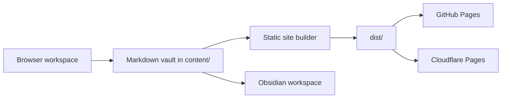

# Publishing Architecture

The repository is designed around a simple path:



## Publication targets

### GitHub Pages

The GitHub Actions workflow builds the `content/` vault into `dist/` and publishes it with Pages. This is the simplest public publishing path.

### Cloudflare Pages

Cloudflare Pages can run the same build command:

```bash
npm run build
```

and publish the `dist` directory. The included `wrangler.toml` documents the expected project settings.

## Secure workspace options

Static hosting alone cannot safely write files back to the repository. For human create/update/upload/delete operations, use one of these modes:

1. **Local-first Git mode** — edit Markdown locally in Obsidian or any editor, then commit and push.
2. **Browser draft mode** — use the included site workspace to draft notes in local browser storage, then export Markdown files for commit.
3. **Encrypted cloud mode** — add a Cloudflare Pages Function that encrypts note payloads client-side before storage in Cloudflare R2 or D1. Keep encryption keys outside the server so the storage provider only sees ciphertext.
4. **Repository PR mode** — use GitHub OAuth or a fine-scoped GitHub App to create pull requests instead of directly writing to the default branch.

## Recommendation

Start with local-first Git mode plus browser draft mode. Add encrypted cloud mode only when multiple humans need live web editing from untrusted devices.
