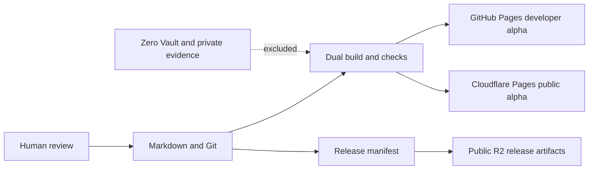

# Publishing Architecture

The alpha uses one canonical source and two intentionally different public renderings.



## GitHub Pages

GitHub Pages publishes the developer build from `dist-developer/`. It contains every classified P0 and P1 note, build logic, architecture, release metadata, and known gaps.

The Git repository is the canonical metadata and change-history layer.

## Cloudflare Pages

Cloudflare Pages publishes `dist-public/`. It contains only P0 material and the curated project explanation.

Cloudflare's Git integration and preview deployments support branch-specific previews without replacing the production deployment. Preview URLs are not canonical.

## R2

R2 stores immutable PUNNARAJ-authored artifacts listed by a release manifest. Git stores the metadata; R2 stores the bytes.

Proposed object keys:

```text
releases/<artifact>/<version>/<sha256>/<filename>
manifests/<release-id>.json
```

Upstream operating-system images remain referenced by official URL and checksum during alpha rather than copied into public R2.

## D1

D1 is deferred. Static content and release metadata do not yet require a second database. A dedicated database may be added later for verified dynamic requirements such as submissions, approval state, or queryable release status.

## Release rule

One commit must produce both surfaces. Each generated `release.json` records the source commit, source date, surface, classification set, and note count.
