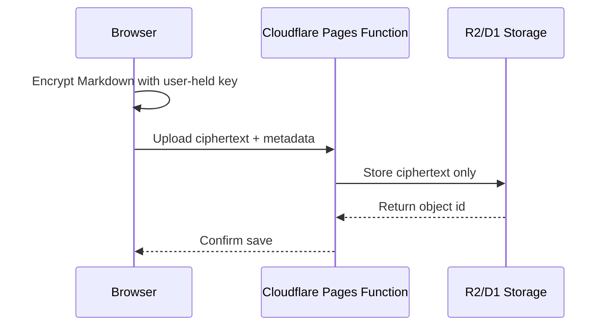

# Security Model

The public site should never be treated as private storage. The safe model is to separate content into three classes.

## Content classes

| Class | Location | Publishing | Notes |
| --- | --- | --- | --- |
| Public MUD | `content/` | Yes | Reviewed Markdown meant for public or team viewing. |
| Draft local memory | Browser local storage or local files | No until exported/committed | Useful for quick capture. |
| Sensitive memory | Encrypted object storage or private repo | No public plaintext | Client-side encryption before upload. |

## Encryption direction

For encrypted cloud mode, prefer this pattern:

The server should not receive plaintext or long-lived decryption keys.
