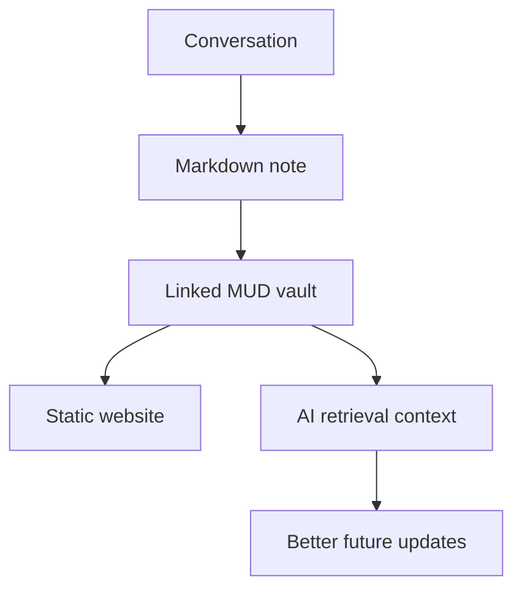

# Memory Graph

The PUNNARAJ MUD should behave like a memory graph: each document is a node, and links show how intent, decisions, and implementation details depend on each other.

## Current seed model

- Conversation context becomes Markdown notes.
- Notes are connected with wiki links.
- Search and graph navigation provide retrieval.
- Future AI context can use the vault as a retrieval source.

## Future vector layer

A future memory controller can index the Markdown vault into embeddings, but the canonical source should remain Markdown. This keeps the project portable and auditable.
