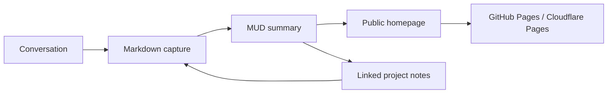
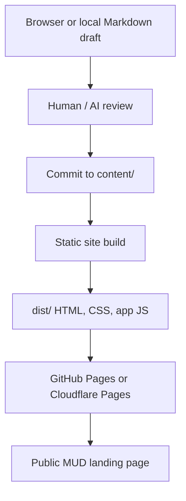
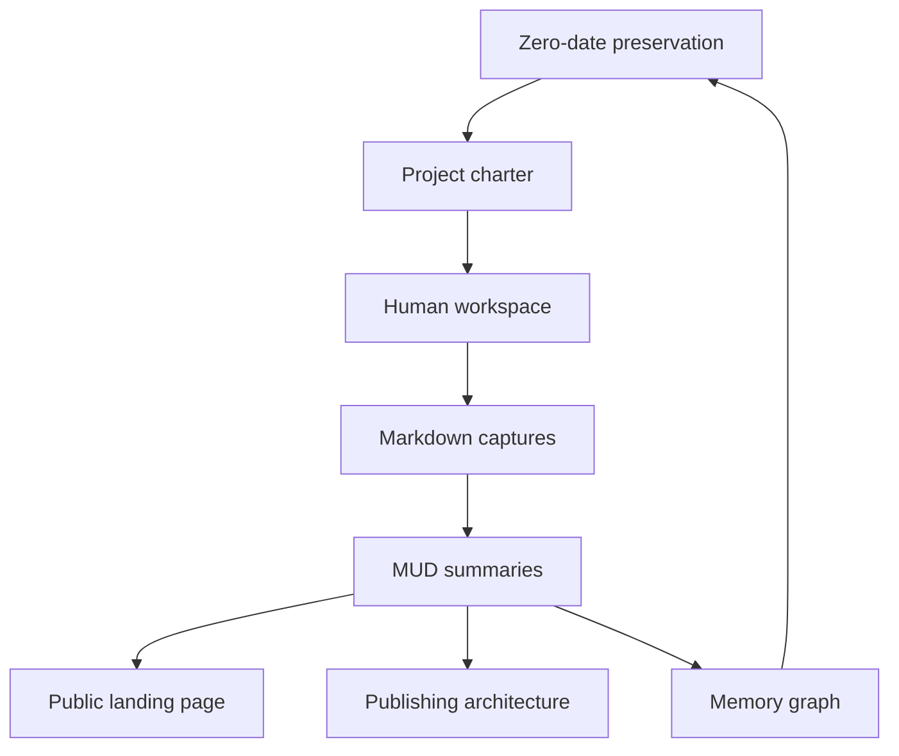

# PUNNARAJ Mutual Understanding Document

The **PUNNARAJ MUD — Mutual Understanding Document** is a public memory surface for a living project. It turns conversation into durable Markdown, turns Markdown into shared understanding, and keeps enough context available that humans and AI workers can continue without repeatedly starting from zero.

This landing page is the front door: a compact public map for the project background, process, publishing route, and memory graph.

## Project Background

PUNNARAJ treats time as the rarest project material. The work is not only to build pages or documents; it is to preserve the first intention, the current direction, and the decisions that would otherwise disappear inside private chat histories.

The MUD exists so the project can:

- Preserve the **zero-date** origin and continuity rule.
- Convert scattered conversation into readable public knowledge.
- Keep project architecture, workflows, and memory in one Markdown-first place.
- Let future contributors, maintainers, and AI workers understand what happened before they arrived.

Start with these foundation notes:

- [[10-mud/project-charter|Project Charter]] — what this project serves.
- [[10-mud/zero-date-preservation|Zero-Date Preservation]] — the first memory and continuity rule.
- [[20-architecture/publishing-architecture|Publishing Architecture]] — GitHub Pages, Cloudflare Pages, and secure workspace options.
- [[40-memory/memory-graph|Memory Graph]] — how conversations, documents, and decisions connect.
- [[30-workflows/human-workspace|Human Workspace]] — create, update, upload, delete, and publish flow.

## What PUNNARAJ Aims For

PUNNARAJ aims to make project memory fast, visible, and reusable. Instead of treating chat as disposable, the project treats every useful exchange as a possible seed for a public note, decision record, architecture page, or next action.

| Aim | Meaning |
| --- | --- |
| Preserve time | Capture useful thinking before it is lost. |
| Publish understanding | Make the public homepage reflect the actual project state. |
| Support continuity | Give each new worker enough context to continue safely. |
| Invite improvement | Keep the MUD editable, linked, and ready for better summaries. |

## How the MUD Process Works

The MUD process is intentionally simple: talk, capture, summarize, publish, and repeat. A conversation can become a draft note; a draft note can become a clearer project summary; a summary can become part of the public homepage or deeper vault.

The loop matters more than perfection. Each pass should make the memory easier to find, easier to understand, or easier to build from.

## Public Publishing Flow

The public publishing flow separates private creation from public presentation. Browser drafts and repository Markdown can be revised first, then the static builder renders the vault into HTML for hosting.

This keeps the homepage practical: it does not need a heavy application server to communicate the project. It only needs maintained Markdown, a reliable build, and a publishing target.

## Memory Graph Concept

The memory graph is the shape behind the MUD. Pages are not isolated files; they are connected memory nodes. A charter links to workflows, workflows link to publishing, publishing links to public pages, and every useful note can point back to the zero-date principle.

A healthy memory graph should answer three questions quickly:

- **Where did this idea come from?**
- **What decision or summary does it support?**
- **Where should the next worker continue?**

## Open the MUD

Use this public home as the opening point, then move into the deeper notes when you need detail.

- Open the [[10-mud/project-charter|Project Charter]] to understand purpose.
- Open [[10-mud/zero-date-preservation|Zero-Date Preservation]] to understand continuity.
- Open [[30-workflows/human-workspace|Human Workspace]] to capture or export drafts.
- Open [[20-architecture/publishing-architecture|Publishing Architecture]] before changing the publication path.
- Open [[40-memory/memory-graph|Memory Graph]] when linking new notes into the wider project memory.

## Operating Principle

Time is the irrecoverable resource. The MUD should make project memory fast to capture, fast to publish, and hard to lose.
